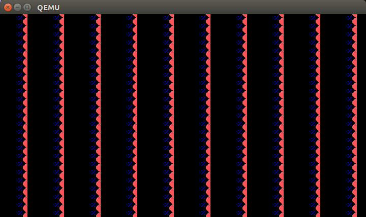

os
==

#need tools
Ubuntu clang version 3.5-1ubuntu1 (trunk) (based on LLVM 3.5)
Target: x86_64-pc-linux-gnu
Thread model: posix

grub2

QEMU emulator version 2.0.2, Copyright (c) 2003-2008 Fabrice Bellard
---
# how to make development environment
ubuntu 14.04
install
    grub2
    qemu

---
#License
This software is released under the MIT License, see LICENSE.txt.

## ScreenShot(bug)

